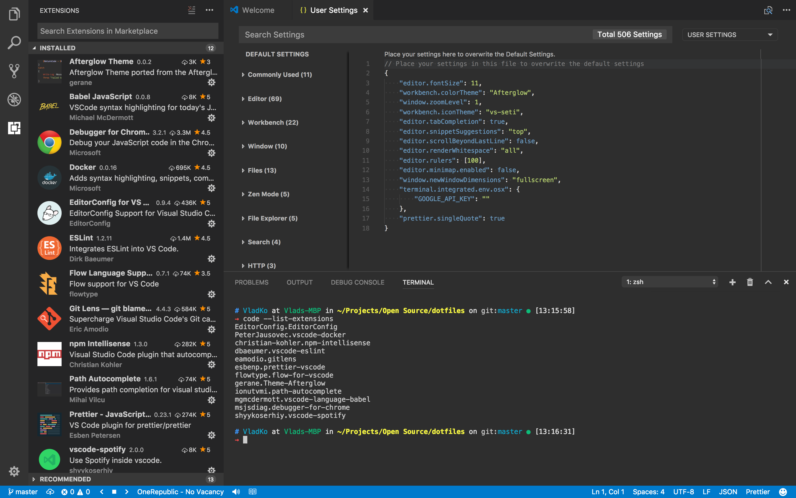

# Dotfiles

Here I will keep the basic tools, links and config files in order to make transfer to a new MacOS system faster.  
My editor of choice at the moment is [Visual Studio Code](#vs-code) so most of the config is for it.

#### Terminal

I use [OhMyZsh](https://github.com/robbyrussell/oh-my-zsh#basic-installation) with [honukai](https://github.com/oskarkrawczyk/honukai-iterm-zsh#installation) theme as my primary shell in [Hyper](https://hyper.is/) and VSCode's integrated terminal.  
I use several custom [plugins](/hyper/hyper.js).

1) Install [OhMyZsh](https://github.com/robbyrussell/oh-my-zsh#basic-installation)
2) Download a [theme](https://raw.githubusercontent.com/oskarkrawczyk/honukai-iterm-zsh/master/honukai.zsh-theme)
3) Move the theme to the themes folder  
   `mv ./honukai.zsh-theme ./.oh-my-zsh/themes/`
4) Set theme to honukai  
   `vi .zshrc` -> `ZSH_THEME=honukai`

#### Tools
- [Terminal](#terminal)
- [Homebrew](https://brew.sh/index.html)
- [Node](https://nodejs.org/en/)
- [Yarn](https://yarnpkg.com/en/docs/install)
- Global node modules:
  - [ncu](https://www.npmjs.com/package/npm-check-updates)
  - [gtop](https://www.npmjs.com/package/gtop)
- [Docker](https://docs.docker.com/docker-for-mac/install/#download-docker-for-mac)
- [MongoDB](https://docs.mongodb.com/manual/tutorial/install-mongodb-on-os-x/#install-mongodb-community-edition-with-homebrew)
  - Giving correct [permissions](https://stackoverflow.com/a/29003511) to the db folder

#### Git

Running `yarn restore:git-config` will:
1) Setup common [aliases](https://git-scm.com/book/tr/v2/Git-Basics-Git-Aliases)
2) Fill my public user info
3) Setup VSCode as a default [mergetool](https://stackoverflow.com/a/44549734)

#### Vim
VIM settings and config are in [this folder](/vim).  
These files should be copied to the user root.

#### VS Code

1) [Download](https://github.com/Microsoft/vscode) the editor
2) Clone this repo
  `git clone https://github.com/v1adko/dotfiles.git && cd /dotfiles`
3) Enable `code` command in the terminal by doing `Shift + CMD + P` -> `'Install "code" command in PATH'`  
4) Install [tools](#tools) - node and yarn in particular.
5) Run the [restore](#settings-backup-restore) commands

##### Settings Backup Restore

To restore all settings, keybindings and snippets run  
`yarn restore:vscode-settings`

##### Extensions Installation
To install all extensions specified in [extensions.yml](./vscode/extensions.yml) run  
`yarn restore:vscode-extensions`

#### TODO:
- [ ] Add symlink setup to avoid moving files and copying config
