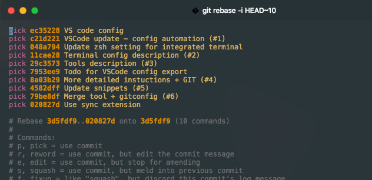

#### VIM

Contents of this folder should be copied to the user root.

1) Download an [afterglow](https://github.com/danilo-augusto/vim-afterglow) theme.  
`cd`  
`curl -LJO https://github.com/danilo-augusto/vim-afterglow/blob/master/colors/afterglow.vim`  
2) Move it to the proper subdirectory (possibly need to create said folders)  
`mv ./afterglow.vim ./.vim/colors/`  
  
Interactive `git rebase`:  

  
Regular `.js` file:  

